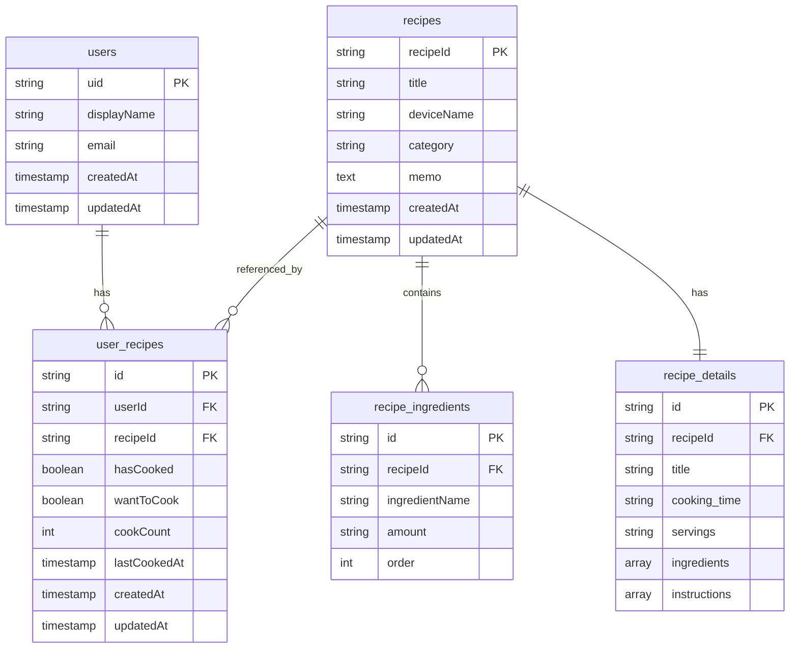

### 概要

ホットクックという自動調理鍋を持っていますが、より調理において効率化ができればと思いました。
投稿したメニューの中から1週間の献立を自動作成したり、自分で献立にメニューを追加することができ、
食材リストを抽出できます。
このアプリを使えば買い物は1週間に1度で大丈夫になります。
Google認証を使用しており、ログインすることでレシピの投稿・閲覧・編集・削除が可能です。
Firebaseを使用しています。

### 画面

### ER 図

%% https://mermaid-js.github.io/mermaid-live-editor/

### アプリ URL

https://hotcook-dictionary-je8p6t6z7-aisudo19s-projects.vercel.app/

### 技術スタック
React 18
Firebase
React Testing Library

### 苦労した点
複数のコンポーネントでFirebaseからのデータを共有する際の設計や、
ユーザが保存したレシピを取得するために、Firestoreのuser_recipesとrecipesコレクションを連結させる点など

