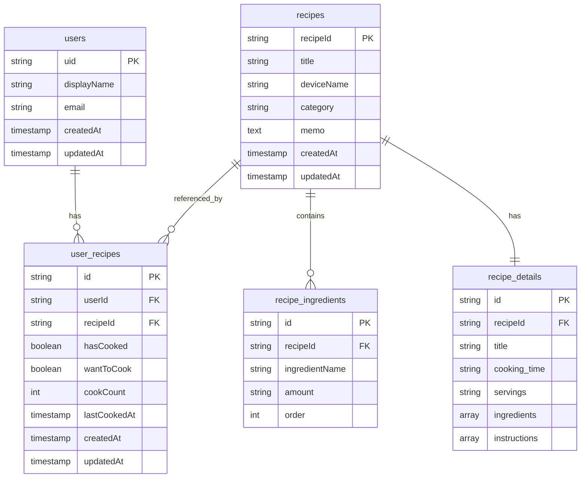

### 概要

ホットクックという自動調理家電を使っているのですが、作れる料理が幅広いのにも関わらずいつも決まったものしか作っていないことが課題だと考えていました。
最近親戚がホットクックを買ったのですが、機能が色々あって使いこなせていないと聞きました。

ホットクックを使いこなすにはどうすればいいか？を考えて、色々とホットクックで料理を作ってみたい、と思えるようなアプリを開発したいと考えました。

ポケモン図鑑のように、コンプリートできたらちょっと嬉しい気持ちになれればと思い、ホットクック料理図鑑というアプリを作ってみようということになりました。

### ターゲットユーザー

- ホットクックを持っていてまだ使いこなせていない人
- 料理のレパートリーを増やしたい人
- ホットクックを使うことで時短料理ができるようになって、可処分時間を増やしたい人

### 画面

### ER 図

%% https://mermaid-js.github.io/mermaid-live-editor/

### サイト URL

https://hotcook-dictionary-f6klcz2f4-aisudo19s-projects.vercel.app/

### 技術スタック
React 18
Firebase
React Testing Library

### 苦労した点
ユーザが保存したレシピを取得するために、Firestoreのuser_recipesとrecipesコレクションを連結させる必要がありました。
調べながら実装しました。

### 開発の流れ

Python の Selenium を使って Web 上の公式レシピを取得しました。
その際には、サーバに負荷をかけないよう一定程度の時間をおいてリクエストを送るようにしました。

取得できた CSV を json に変換し、Firestore にアップロードしました。
その際、Firestore へのアップロードは複数回行われると見込み、
管理者のみ Firestore へのアップロードを行う機能を追加しました。

レシピ一覧を取得し、検索とフィルタリング機能を実装しました。
ログイン・ログアウトの機能を追加し、ユーザごとに保存した情報を確認・更新することができるようにしました。
